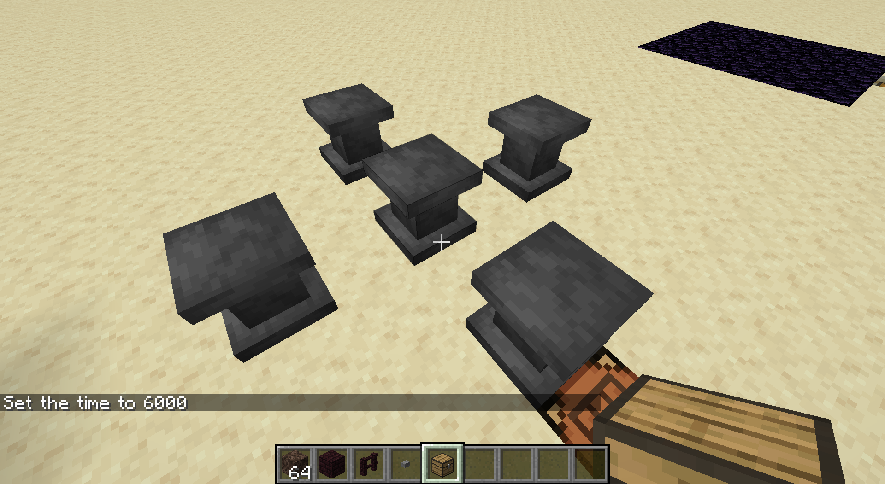

# VanillaPlusPlus
This is my WIP mod called Vanilla++ for Minecraft version 1.16.1

It is called Vanilla++ because my intention is to add things that I believe fit the spirit of vanilla Minecraft. (No crazy machines here)

# New Features
## Blocks
* **Concrete Stairs** - These are crafted like other stairs but with concrete

* **Concrete Slabs** - See above

* **Item Stands** - You can right click an item stand with any item in your inventory to display it in glorious 3D on top of the stand

    *Recipe*: 
    III 
    &nbsp;I&nbsp; 
    III 
    I = Iron Ingot

* **Steel Block** - Crafted like a normal metal block but with steel. It can also be used as a beacon base

* **Steel Scaffold** - Crafted like vanilla scaffolding but with steel instead of bamboo. Steel scaffolding has a 20 block build limit before falling down instead of the vanilla 7.

* **Nether Star Block** - Crafted with 9 nether star ingots. Doesn't have a use right now but it can also be used as a beacon base.

* **Advanced Dispenser** - The Advanced Dispenser can place certain blocks in the world.

    *Recipe*: 
    GGG 
    GNG 
    GRG 
    G = Gold Ingot, N = Nether Star Ingot, R = redstone

* **Sulfur Ore** - Spawns in Nether Waste biomes. Drops sulfur

* **Saltpeter Ore** - Spawns in the Overworld. Drops saltpeter

## Fluids
Vanilla++ adds molten metal fluids for gold, iron, and steel. These are created by placing metal block adjacent to magma blocks. The more magma blocks it is adjacent to, the fast it will melt

These fluids can be turned back to their solid form by slowly cooling while not touching magma blocks or by running water over them.

**Note:** Molten steel is created by clicking a molten iron source block with a block of coal

## Items
* **Steel Tools** - Crafted like any other tool set

* **Sulfur** - Dropped from Sulfur Ore. Combine with saltpeter and charcoal to make gunpowder

* **Saltpeter** - See above
 
* **Wither Bones** - Wither skeletons will no longer drop regular bones. They will drop wither bones

* **Wither Bone Meal** - Crafted from wither bones. Can be used to grow nether wart in a 3x3 area

* **Nether Star Shard** - Blow up a nether star to create nether star shards. Right now these are only used for Advanced Dispensers and Nether Star Ingots but I have more plans for these in the future

* **Nether Star Ingot** - Crafted with 4 nether star shards around a netherite ingot. Used for max level enchantments (btw I changed the enchanting system. We'll talk about that in a bit)

* **Steel Ingots** - Used to make steel tools and steel scaffolding

* **Dynamite** - A less powerful, throwable form of tnt

    *Recipe*: 
    &nbsp; S&nbsp; 
    PGP 
    PGP 
    S = String, P = Paper, G = Gunpowder
 
## World Generation
* **You can now find pools of molten iron in Nether Waste biomes**

* **Boulders that contain coal and iron ores will spawn in plains and savannah biomes**

There is much more to come on the world generation front. I just wanted to dip my toes into it as it can get quite complex. I also wanted to hold off on doing too much of this because of the world gen options coming to datapacks in 1.16.2
    
## Misc
* **Path Blocks can now be picked up with Silk Touch**

* **Wither Bone Meal can be used from dispensers**

* **Molten metal buckets can be used in dispensers just like lava and water can be**

* **Flint and Steel now requires steel to craft**

* **The texture for bedrock now has lower contrast**

* **The texture for chests has been changed to resemble oak planks** I did this because I am planning to add wood variations for chests but that didn't make it into this version

## The enchanting system - Infusion
I have completely changed the enchanting system. The enchanting table still exists but it will no longer give you enchantments like 'Efficiency', 'Unbreaking', 'Silk Touch', etc.

Because of this there are some tools that will no longer give you enchantment options if you put them in the enchanting table

In order to create the "Good" enchanted books you will need to use Item Stands in a plus pattern like this:

Each item stand recipe consists of an item on the center stand and up to four items on the outer stands (**Right now this is only used to create enchanted books so the center item will always be a book**). You will then have to right click the center stand with lapis which will be consumed

Please note that this sytem is subject to change. For example, I have toyed with the idea of making center item stand a separate unique block that is more difficult to craft or perhaps need to be found in the world
### Infusion Recipes

Center: Book 
Outer: 1xDried Kelp Block, 1xSea Pickle, 1xPrismarine, 1xTurtle Egg 
Output: Aqua Affinity 

Center: Book 
Outer: 3xChain, 1xFermented Spider Eye 
Output: Curse of Binding 

Center: Book 
Outer: 3xGlass, 1xFermented Spider Eye 
Output: Curse of Vanishing 

Center: Book 
Outer: 4xSugar 
Output: Efficiency 1 

Center: Book 
Outer: 3xGlowstone Dust, 1xEfficiency 1 Book 
Output: Efficiency 2 

Center: Book 
Outer: 3xGlowstone Block, 1xEfficiency 2 Book 
Output: Efficiency 3 

Center: Book 
Outer: 3xRedstone Block, 1xEfficiency 3 Book 
Output: Efficiency 4 

Center: Book 
Outer: 1xDiamond Pickaxe, 1xCake, 1xNether Star Ingot, 1x Efficiency 4 Book 
Output: Efficiency 5 

Center: Book 
Outer: 4xIron Block 
Output: Fortune 1 

Center: Book 
Outer: 3xGold Block, 1xFortune 1 Book 
Output: Fortune 2 

Center: Book 
Outer: 3xDiamond Block, 1xFortune 2 Book 
Output: Fortune 3 

Center: Book 
Outer: 3xArrow, 1xNether Star Ingot 
Output: Infinity 

Center: Book 
Outer: 2xDragon's Breath, 2xNether Star Ingot 
Output: Mending 

Center: Book 
Outer: 4xObsidian 
Output: Protection 1 

Center: Book 
Outer: 3xObsidian, 1xProtection 1 Book 
Output: Protection 2 

Center: Book 
Outer: 3xCrying Obsidian, 1xProtection 2 Book 
Output: Protection 3 

Center: Book 
Outer: 2xCrying Obsidian, 1xNether Star Ingot, 1xProtection 3 Book 
Output: Protection 4 

Center: Book 
Outer: 4xQuartz 
Output: Sharpness 1 

Center: Book 
Outer: 3xQuartz Block, 1xSharpness 1 Book 
Output: Sharpness 2 

Center: Book 
Outer: 2xDiamond, 1xQuartz Block, 1xSharpness 2 Book 
Output: Sharpness 3 

Center: Book 
Outer: 3xDiamond Block, 1xSharpness 3 Book 
Output: Sharpness 4 

Center: Book 
Outer: 1xDiamond Sword, 1xNether Star Ingot, 1xSharpness 4 Book 
Output: Sharpness 5 

Center: Book 
Outer: 4xMossy Cobblestone 
Output: Silk Touch 

Center: Book 
Outer: 4xChiseled Stone Bricks 
Output: Unbreaking 1 

Center: Book 
Outer: 3xObsidian, 1xUnbreaking 1 Book 
Output: Unbreaking 2 

Center: Book 
Outer: 1xDiamond Chestplate, 1xDiamond Leggings, 1xNether Star Ingot, 1xUnbreaking 2 Book 
Output: Unbreaking 3 